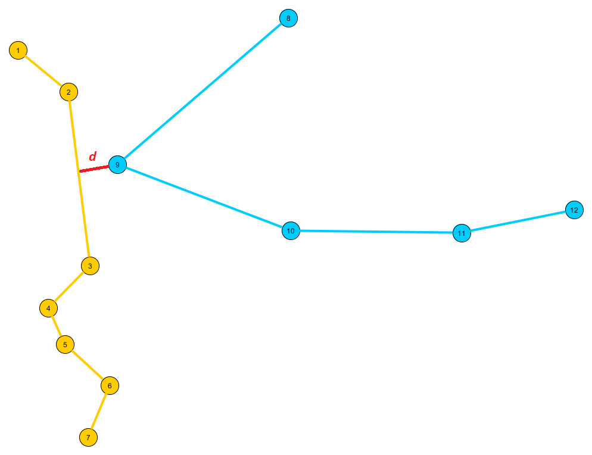

# Minimal distance between two polylines

## Task
Given 2 [polylines](https://en.wikipedia.org/wiki/Polygonal_chain) as `std::vector` of points the `arePolylinesCloserThanThreshold` in *distance.h* checks that if the
two polylines are closer to each other than a given distance threshold. It returns true if they are closer, and false if they are not. The distance threshold `DISTANCE_THRESHOLD` is set to 1.5F.




## Structure
Polylines are defined as
```cpp
std::vector<sPoint2D> polyline{sPoint2D(2.0F, 3.0F), sPoint2D(3.0F, 4.0F), sPoint2D(2.0F, 6.0F)};
```
a vector of 2D dimenasional point structures
```cpp
struct sPoint2D
{
  sPoint2D(float xValue, float yValue)
  {
    x = xValue;
    y = yValue;
  }
  float x;
  float y;
};
```

### Folder structure
The root folder contains the *main.cpp* file with a minimal example, while the *headers* folder collects all the necessary functions, more precisely: 
- **misc.h**: general min and max functions
- **structs.h**: definition of sPoint2D
- **linalg.h**: basic vector operations between polyline segments
- **polyline.h**: basic, non-mathematical operations between polyline (e.g.: split, tensor product)
- **distance.h**: lists all the possible distances (e.g.: distance of two points, point-segment distance, distance of two segments)

## Algorithms
The task was solved by two different approach:
- **brute-force**: Calculates the distance for all segment pairs. If it found a smaller distance as the pre-defined treshold break the iteration.
- **advanced**: In every step it splits the polylines and with a bounding box techniques checks if the possible achievable distance is smaller then the pre-defined threshold. If it is then for further process it takes it in the queue, if not then discards. Each iteration stops if one of the iterational polyline is not a polyline (i.e. it is a segment) or the possible achievable distance is bigger then the aimed.

## Runtime complexity
The **brute-force** algorithm scales with O(n<sup>2</sup>)

```math
SE = \frac{\sigma}{\sqrt{n}}
```

<pre xml:lang="latex">\sqrt{2}</pre>

  

further improved by rid off sqrt and deal with...

